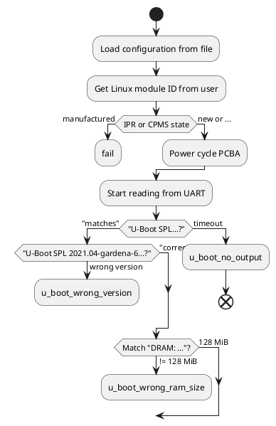

# Architecture

## Capabilities

- Reusable logic to check for output existing/not existing
- Enter U-Boot shell, execute interactive commands and verify their output
- Map error code to user instructions
- Log of all commands executed and their output, stored in a file

## Execution flow

next...:
- plantuml
- Hard fail if LM is assembled according to IPR
- Query and store state in CPMS:
  - Parent (GWID), RMID
- Hard fail if GWID is already finalized
- Check CPMS if bootstrapping has been successful
  - If so:
    - Warn user that this tool will not find anything and ask if they want to continue
  - If not:
    - Hard fail
- Check u_boot_missing_eth0 
- Check for u_boot_corrupt_factory_data
- Log in to U-Boot shell
- Query LM ID and compare to user provided value (linux_module_wrong_id)
- Check for u_boot_faulty_nand_flash
- Verify U-Boot checksum
- Check u_boot_stuck_button
- Attempt to extract gateway ID and radio module ID
  - If extraction worked:
    - hard fail if IPR/CPMS data do not match
    - redirect to gateway analyzer and ask if user wants to simply reset the gateway
- Disassemble RM from PCBA in CPMS
- Disassemble LM from PCBA in CPMS
- run do_start_over
- Redo passive checks
- Check for u_boot_network_link_up_timeout
- (set dev_bootargs to make Linux boot verbosely)
- Let Linux boot
- Log in to Linux shell
- Verify 3 green LEDs (via /sys/class/...)
  - If failing:
    - `systemctl`
    - `journalctl --boot`
    - Check: radio_module_programming_error

## Glossary
- Passive U-Boot checks
- Interactive U-Boot checks
- Passive Linux checks
- Interactive Linux checks

Always active:
- Instant fail regex:
  - "^Ooops:$"
  - "^### ERROR ### Please RESET the board ###$"